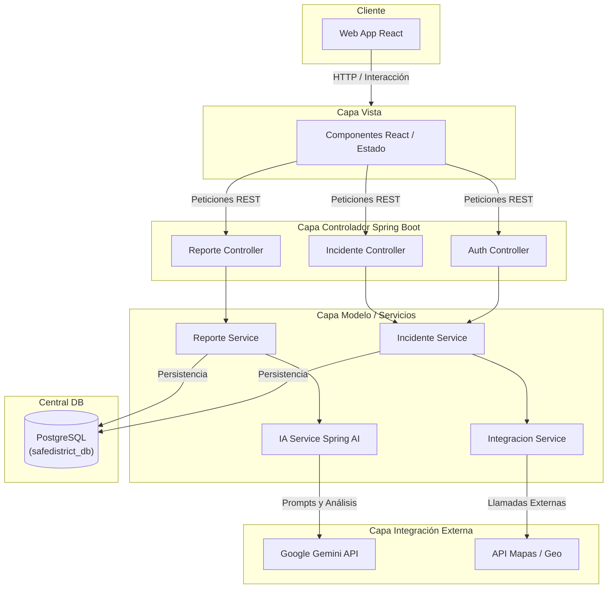

# SafeDistrict - Sistema IA para Priorización de Emergencias

SafeDistrict es una solución tecnológica diseñada para optimizar la gestión de emergencias mediante Inteligencia Artificial. El sistema permite la recepción de reportes de ciudadanos, su clasificación automática y la visualización jerárquica de incidentes para los operadores de respuesta.

Este repositorio contiene la arquitectura completa (Full-Stack) de SafeDistrict, integrando un frontend en React, un backend en Spring Boot y procesamiento de Lenguaje Natural (NLP) a través de Google Gemini AI.

## Arquitectura del Sistema

A continuación se presenta el diagrama de arquitectura de capas del sistema SafeDistrict:



## Características Principales

1. **Dashboard Táctico del Operador (Frontend)**:
   - Panel interactivo con estadísticas en tiempo real (incidentes activos, críticos, tiempos de respuesta).
   - **Mapa Táctico (`IncidentMap`)**: Un mapa interactivo que posiciona los incidentes geográficamente de acuerdo a su tipo y muestra un resplandor ("halo") basado en la prioridad.
   - Panel de detalles y despachos para la gestión individual de cada emergencia.

2. **Reporte Ciudadano e Inteligencia Artificial (Backend + Gemini API)**:
   - Interfaz de triaje (Chatbot) que permite a los ciudadanos enviar alertas.
   - **Clasificación por IA Real**: Integración con Google Gemini (Spring AI) para evaluar automáticamente el nivel de urgencia, clasificar el tipo de emergencia y asignar una prioridad (Crítico, Alto, Medio, Bajo) basándose en la descripción del usuario.

## Estructura del Repositorio

El proyecto está organizado siguiendo las mejores prácticas de desarrollo:

```text
/
 ├── .github/workflows/       # Integración y despliegue continuo (CI/CD)
 ├── backend/                 # API REST desarrollada en Java con Spring Boot 3
 │   ├── src/main/java/.../   # Paquete principal (com.safedistrict.backend)
 │   │   ├── config/          # Configuraciones (Seguridad, CORS, IA, etc.)
 │   │   ├── controller/      # Controladores REST (Endpoints)
 │   │   ├── dto/             # Objetos de Transferencia de Datos (Request/Response)
 │   │   ├── entity/          # Entidades JPA (Modelos de BD)
 │   │   ├── exception/       # Manejo de excepciones y errores
 │   │   ├── integration/     # Clientes y conectores a APIs externas (OpenAI, etc.)
 │   │   ├── repository/      # Interfaces de acceso a datos (Spring Data JPA)
 │   │   └── service/         # Lógica de negocio y procesamiento
 │   └── pom.xml              # Dependencias de Maven
 ├── database/                # Gestión integral de base de datos PostgreSQL
 │   ├── backups/             # Scripts de automatización de respaldos (pg_dump)
 │   ├── procedures/          # Procedimientos almacenados PL/pgSQL (Lógica de DB)
 │   └── scripts/             # Scripts DDL de inicialización (Creación de tablas)
 ├── docs/                    # Documentación técnica, manuales y diagramas
 │   ├── arquitectura/        # Documentos de arquitectura del sistema
 │   ├── diagramas/           # Diagramas UML y de flujo
 │   └── historias-usuario/   # Historias de usuario y requisitos
 ├── frontend/                # Aplicaciones cliente
 │   └── web-app/             # Aplicación React (Vite) para operadores y reporte
 │       ├── public/          # Archivos estáticos y favicon
 │       └── src/             # Código fuente de React
 │           ├── assets/      # Imágenes y recursos locales
 │           ├── components/  # Componentes de la interfaz de usuario
 │           ├── context/     # Estados globales y contextos (Ej. Theme)
 │           └── data/        # Lógica de clasificación y mocks
 └── tests/                   # Pruebas generales e2e / integración
```

## Tecnologías Utilizadas

- **Frontend**: React, Vite, Lucide React, CSS Vanilla (Variables, Dark Mode).
- **Backend**: Java 21, Spring Boot 3, Spring AI, Spring Data JPA.
- **Base de Datos**: PostgreSQL.
- **Inteligencia Artificial**: Google GenAI API (Gemini 2.0 Flash).

## Arquitectura de Base de Datos y Automatización

El repositorio gestiona la infraestructura de la base de datos de manera centralizada en el directorio `/database`:
- **Scripts de inicialización**: Se definen de forma versionada en `/database/scripts/` (ej. `01_create_incidents_table.sql`), estableciendo esquemas con tipos de datos estructurados.
- **Procedimientos Almacenados**: En `/database/procedures/`, utilizamos PL/pgSQL para delegar la carga de operaciones transaccionales complejas directamente a la base de datos (ej. inserción y actualización de incidentes).
- **Estrategia de Respaldo**: Automatización de snapshots locales mediante scripts ejecutables (ej. `.bat` con `pg_dump`) en `/database/backups/`, garantizando retención segura de datos.

## Instalación y Configuración

### 1. Configuración de Base de Datos y Backend
1. Asegúrate de tener instalado **PostgreSQL** y **Java 21**.
2. Crea una base de datos en PostgreSQL llamada `safedistrict_db`.
3. Ingresa a la carpeta del backend:
   ```bash
   cd backend
   ```
4. Configura tus variables de entorno creando un archivo `.env` basado en `.env.example`:
   ```env
   DB_HOST=localhost
   DB_PORT=5432
   DB_NAME=safedistrict_db
   DB_USERNAME=postgres
   DB_PASSWORD=tu_contraseña_postgresql
   GEMINI_API_KEY=tu_api_key_de_gemini
   ```
5. Ejecuta el servidor de Spring Boot:
   ```bash
   ./mvnw spring-boot:run
   ```

### 2. Configuración del Frontend
1. Asegúrate de tener instalado **Node.js** (versión 18 o superior).
2. En una nueva terminal, ingresa a la carpeta del frontend web:
   ```bash
   cd frontend/web-app
   ```
3. Instala las dependencias:
   ```bash
   npm install
   ```
4. Inicia el servidor de desarrollo:
   ```bash
   npm run dev
   ```
5. Abre tu navegador en la ruta indicada por Vite (usualmente `http://localhost:5173/`).
