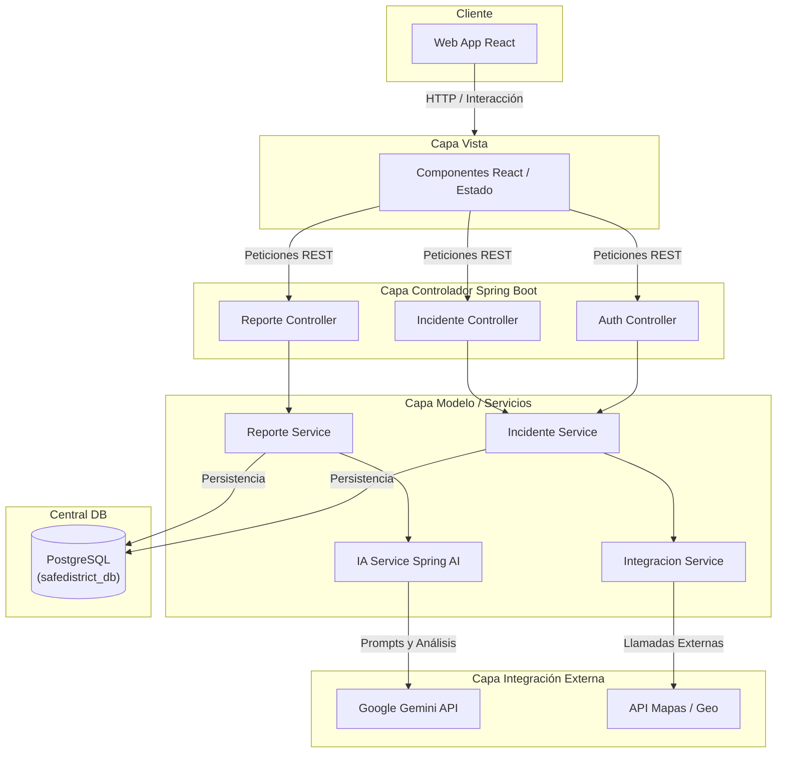

# SafeDistrict - Sistema IA para Priorización de Emergencias

SafeDistrict es una solución tecnológica diseñada para optimizar la gestión de emergencias mediante Inteligencia Artificial. El sistema permite la recepción de reportes de ciudadanos, su clasificación automática y la visualización jerárquica de incidentes para los operadores de respuesta.

Este repositorio contiene la arquitectura completa (Full-Stack) de SafeDistrict, integrando un frontend en React, un backend en Spring Boot y procesamiento de Lenguaje Natural (NLP) a través de Google Gemini AI.

## Arquitectura del Sistema

A continuación se presenta el diagrama de arquitectura de capas del sistema SafeDistrict:



## Características y Mejoras Técnicas Recientes

1. **Dashboard Táctico del Operador (Frontend)**:
   - Panel interactivo con estadísticas en tiempo real (incidentes activos, críticos, tiempos de respuesta).
   - **Mapa Interactivo con Panning Dinámico (`IncidentMap`)**: Un mapa interactivo que no solo posiciona los incidentes geográficamente, sino que también implementa algoritmos de "Drag and Panning" calculados manualmente para navegar el mapa y centrar automáticamente los incidentes seleccionados.
   - **Cálculo Dinámico de ETAs**: El tiempo estimado de llegada de las unidades despachadas se calcula dinámicamente en base a la prioridad de la emergencia asignada por la IA (Ej: Crítico = 2min, Alto = 5min, Medio = 8min, Bajo = 15min).

2. **Reporte Ciudadano e Inteligencia Artificial (Backend + Gemini API)**:
   - Interfaz de triaje (Chatbot) que permite a los ciudadanos enviar alertas de manera accesible.
   - **Clasificación por IA Real**: Integración con Google Gemini (Spring AI) para evaluar automáticamente el nivel de urgencia, clasificar el tipo de emergencia y asignar una prioridad (Crítico, Alto, Medio, Bajo).
   - **Diccionario de Traducción Inteligente**: Módulo de traducción en tiempo real integrado en el frontend que captura identificadores en inglés provenientes del backend (ej. `security_incident`, `crime_armed`) y los normaliza y traduce al español de forma transparente sin romper la estructura de datos original.

3. **Arquitectura de Pruebas y CI/CD (DevOps)**:
   - **Testing Framework**: Implementación de pruebas unitarias y de componentes utilizando `Vitest`, `jsdom`, y `React Testing Library`.
   - **Flujos CI/CD**: Se han integrado flujos automatizados de GitHub Actions (`.github/workflows`) como el `linter.yml` para revisar la calidad del código, y el `build-and-test.yml` para validar compilaciones y ejecutar la suite de pruebas tras cada push o pull request.

## Historias de Usuario

A continuación se detallan las principales Historias de Usuario (HU) que rigen el MVP del sistema:

**Historia de Usuario (HU01)**:
Como ciudadano en situación de riesgo, quiero disponer de un portal web con un chatbot interactivo y botones de pánico, para reportar mi emergencia de forma rápida y sin fricciones.
* **Criterios de Aceptación:**
  * *Escenario:* Envío de alerta inmediata.
  * *Giving:* Necesitar reportar un incidente crítico (ej. Robo).
  * *When:* Deseo presionar el botón de pánico central en el portal.
  * *Then:* El sistema captura mi ubicación GPS y activa el protocolo de despacho automático.

**Historia de Usuario (HU02)**:
Como ciudadano con discapacidad auditiva, quiero canales de comunicación basados en texto, para reportar una emergencia de manera independiente y efectiva.
* **Criterios de Aceptación:**
  * *Escenario:* Reporte mediante chat accesible.
  * *Giving:* Necesitar asistencia de emergencia sin usar la voz.
  * *When:* Deseo iniciar una conversación con el chatbot del sistema.
  * *Then:* El sistema me guía paso a paso para recolectar los datos vitales del incidente.

**Historia de Usuario (HU03)**:
Como operador de la central, quiero que el sistema asigne automáticamente un nivel de prioridad al reporte, para reducir mi fatiga cognitiva y el tiempo de triaje a menos de 10 segundos.
* **Criterios de Aceptación:**
  * *Escenario:* Priorización visual por colores.
  * *Giving:* Un nuevo reporte ingresado con palabras clave de alta peligrosidad (ej. "arma").
  * *When:* El sistema analiza el texto mediante modelos de Machine Learning.
  * *Then:* El sistema resalta automáticamente la alerta en color rojo en mi dashboard.

**Historia de Usuario (HU05)**:
Como jefe de unidad en campo, quiero recibir el despacho digital con la ubicación exacta, para llegar al lugar del incidente sin depender de instrucciones verbales imprecisas.
* **Criterios de Aceptación:**
  * *Escenario:* Visualización de ruta óptima.
  * *Giving:* Una emergencia crítica asignada a mi unidad.
  * *When:* Deseo consultar el mapa interactivo en mi terminal táctil.
  * *Then:* El sistema muestra la ubicación del ciudadano y la ruta más rápida basada en el tráfico real.

## Estructura del Repositorio

El proyecto está organizado siguiendo las mejores prácticas de desarrollo:

```text
/
 ├── .github/workflows/       # Integración continua (CI) y Tests automatizados
 ├── backend/                 # API REST desarrollada en Java con Spring Boot 3
 │   ├── src/main/java/.../   # Paquete principal (com.safedistrict.backend)
 │   │   ├── config/          # Configuraciones (Seguridad, CORS, IA, etc.)
 │   │   ├── controller/      # Controladores REST (Endpoints)
 │   │   ├── dto/             # Objetos de Transferencia de Datos (Request/Response)
 │   │   ├── entity/          # Entidades JPA (Modelos de BD)
 │   │   ├── exception/       # Manejo de excepciones y errores
 │   │   ├── integration/     # Clientes y conectores a APIs externas (OpenAI, etc.)
 │   │   ├── repository/      # Interfaces de acceso a datos (Spring Data JPA)
 │   │   └── service/         # Lógica de negocio y procesamiento
 │   └── pom.xml              # Dependencias de Maven
 ├── database/                # Gestión integral de base de datos PostgreSQL
 │   ├── backups/             # Scripts de automatización de respaldos (pg_dump)
 │   ├── procedures/          # Procedimientos almacenados PL/pgSQL (Lógica de DB)
 │   └── scripts/             # Scripts DDL de inicialización (Creación de tablas)
 ├── docs/                    # Documentación técnica, manuales y diagramas
 │   ├── arquitectura/        # Documentos de arquitectura del sistema
 │   ├── diagramas/           # Diagramas UML y de flujo
 │   └── historias-usuario/   # Historias de usuario y requisitos
 ├── frontend/                # Aplicaciones cliente
 │   └── web-app/             # Aplicación React (Vite) para operadores y reporte
 │       ├── public/          # Archivos estáticos y favicon
 │       ├── tests/           # Suite de Pruebas Unitarias y Componentes (Vitest)
 │       └── src/             # Código fuente de React
 │           ├── assets/      # Imágenes y recursos locales
 │           ├── components/  # Componentes de la interfaz de usuario
 │           ├── context/     # Estados globales y contextos (Ej. Theme)
 │           └── data/        # Lógica de clasificación y motor
 └── tests/                   # Pruebas generales e2e / integración
```

## Tecnologías Utilizadas

- **Frontend**: React, Vite, Lucide React, Vitest, React Testing Library.
- **Backend**: Java 21, Spring Boot 3, Spring AI, Spring Data JPA.
- **Base de Datos**: PostgreSQL.
- **Inteligencia Artificial**: Google GenAI API (Gemini 2.0 Flash).
- **DevOps/CI**: GitHub Actions.

## Instalación y Configuración

### 1. Configuración de Base de Datos y Backend
1. Asegúrate de tener instalado **PostgreSQL** y **Java 21**.
2. Crea una base de datos en PostgreSQL llamada `safedistrict_db`.
3. Ingresa a la carpeta del backend:
   ```bash
   cd backend
   ```
4. Configura tus variables de entorno creando un archivo `.env` basado en `.env.example`:
   ```env
   DB_HOST=localhost
   DB_PORT=5432
   DB_NAME=safedistrict_db
   DB_USERNAME=postgres
   DB_PASSWORD=tu_contraseña_postgresql
   GEMINI_API_KEY=tu_api_key_de_gemini
   ```
5. Ejecuta el servidor de Spring Boot:
   ```bash
   ./mvnw spring-boot:run
   ```

### 2. Configuración del Frontend y Pruebas
1. Asegúrate de tener instalado **Node.js** (versión 18 o superior).
2. En una nueva terminal, ingresa a la carpeta del frontend web:
   ```bash
   cd frontend/web-app
   ```
3. Instala las dependencias:
   ```bash
   npm install
   ```
4. **Para correr el entorno de desarrollo:**
   ```bash
   npm run dev
   ```
   Abre tu navegador en la ruta indicada por Vite (usualmente `http://localhost:5173/`).

5. **Para correr la suite de pruebas unitarias (Vitest):**
   ```bash
   npm run test
   ```
