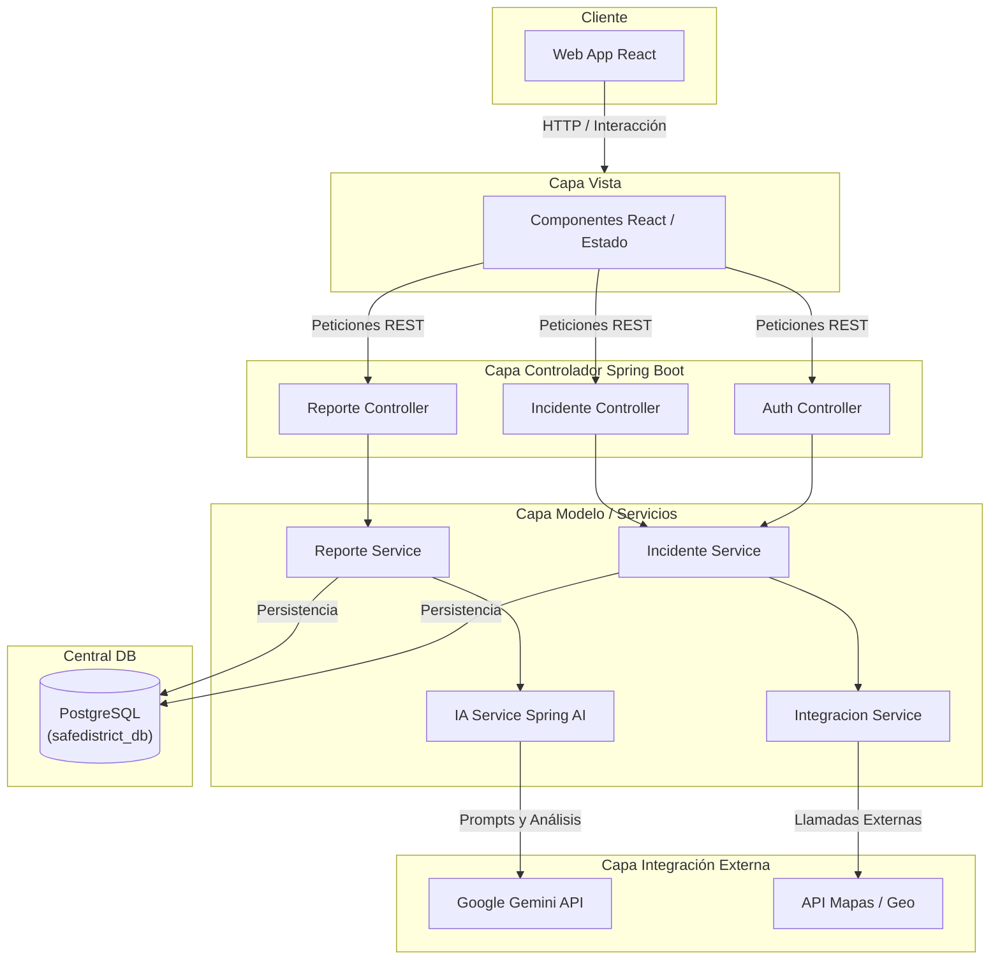

# Arquitectura del Sistema: SafeDistrict

SafeDistrict es un sistema integral (Full-Stack) diseñado para la gestión de emergencias mediante Inteligencia Artificial. A continuación se presenta el documento formal de arquitectura.

## 1. Arquitectura de Alto Nivel

El sistema sigue una arquitectura de capas bien definida:

1. **Capa de Presentación (Frontend)**: Construida con React y Vite. Maneja la interfaz de usuario, visualización de mapas tácticos e interacciones en tiempo real.
2. **Capa de Controladores (API REST)**: Construida en Spring Boot (Java). Expone los endpoints protegidos para que los clientes se conecten.
3. **Capa de Servicios**: Contiene la lógica de negocio, reglas de clasificación y el motor de IA integrado con Spring AI.
4. **Capa de Integración**: Se comunica con proveedores externos como Google Gemini API (para análisis NLP) y servicios de geolocalización.
5. **Capa de Datos**: Base de datos relacional PostgreSQL con funciones PL/pgSQL para procesamiento intensivo de datos.

## 2. Diagrama de Arquitectura de Capas

## 3. Patrones de Diseño Utilizados

- **MVC (Model-View-Controller)**: Separación clara entre la vista (React), los controladores (Spring REST) y los modelos de datos (Entidades JPA).
- **Service Pattern**: La lógica de negocio está aislada en servicios independientes.
- **Data Transfer Objects (DTO)**: Para evitar exponer entidades de base de datos directamente al cliente, previniendo sobre-exposición de datos sensibles.
- **Repository Pattern**: Abstracción de la base de datos usando Spring Data JPA.

## 4. Tecnologías Principales
- **Backend**: Java 21, Spring Boot 3.2, Spring Security, Spring AI.
- **Frontend**: React 18, Vite, TailwindCSS (simulado mediante utility classes custom), React Testing Library.
- **Base de Datos**: PostgreSQL 16.
- **DevOps**: GitHub Actions (CI/CD), Vitest.
