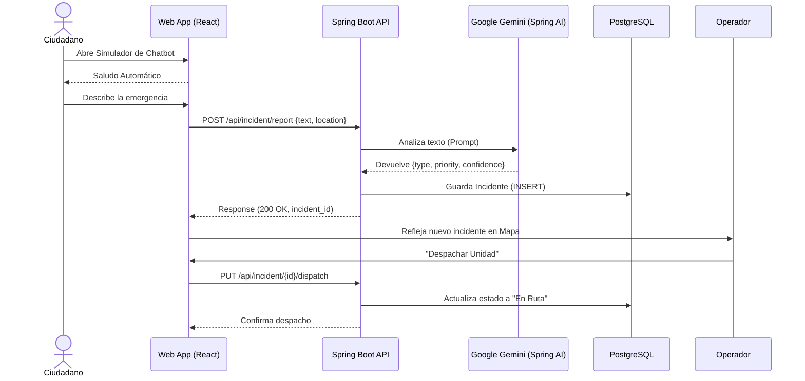
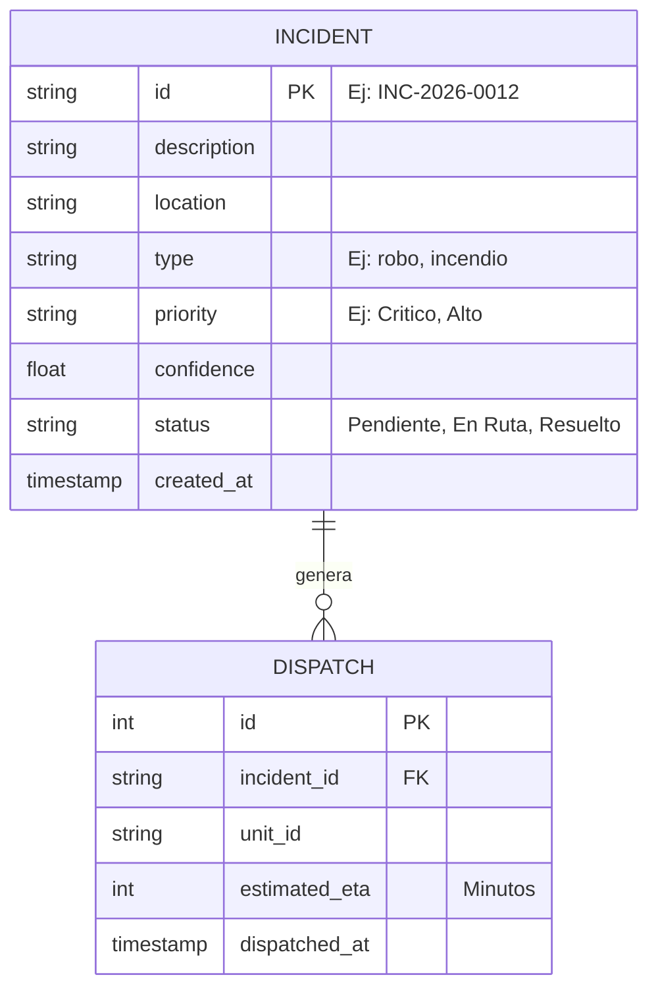
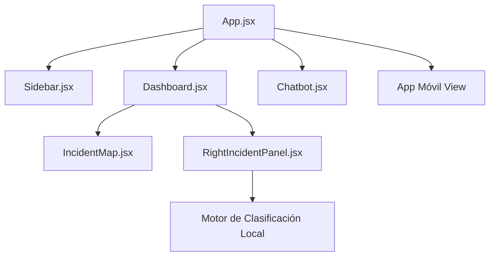

# Diagramas del Sistema: SafeDistrict

Este documento recopila los diagramas principales que modelan el comportamiento y flujo de datos del sistema.

## 1. Diagrama de Flujo: Reporte de Incidente por Ciudadano (Chatbot)

Describe el proceso paso a paso desde que un ciudadano interactúa con el chatbot hasta que el incidente es clasificado y despachado.

## 2. Diagrama Entidad-Relación (Base de Datos)

Modelo conceptual de la base de datos `safedistrict_db`.

## 3. Diagrama de Componentes (Frontend React)

Estructura de la interfaz de usuario en la Web App.

